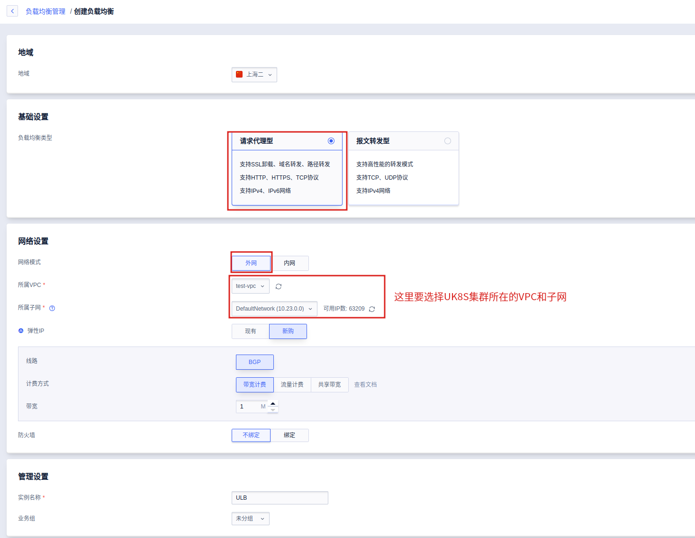
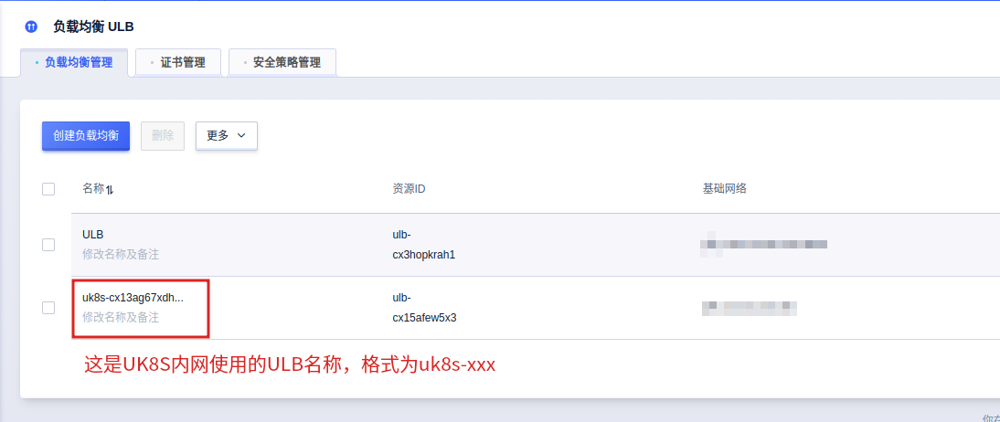
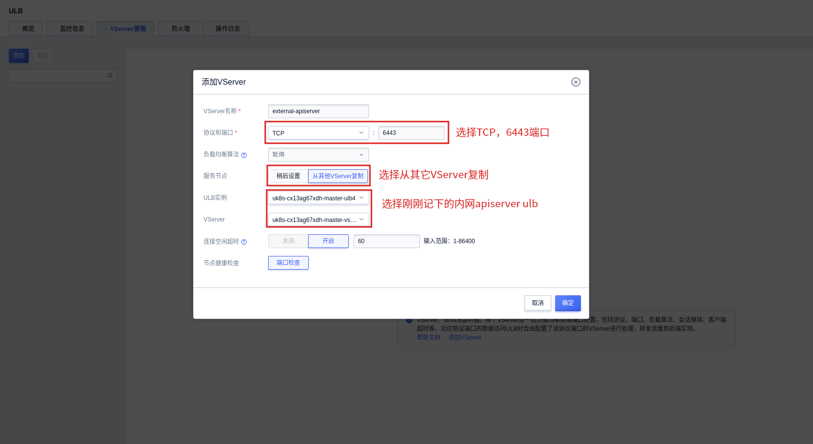
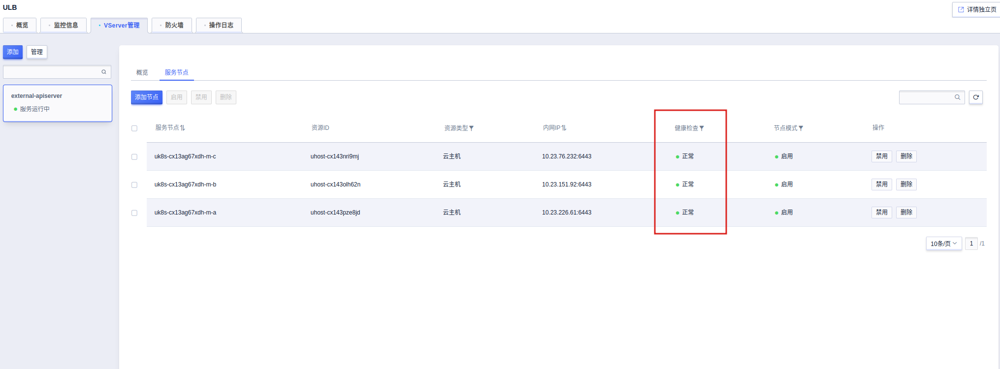
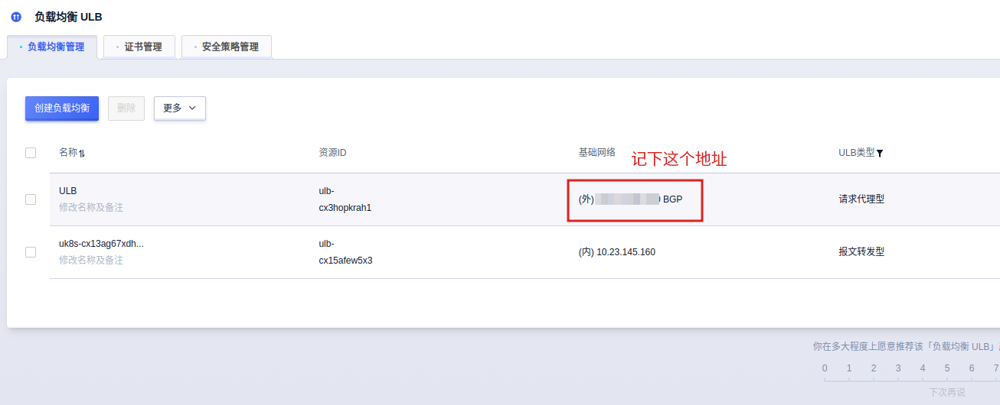
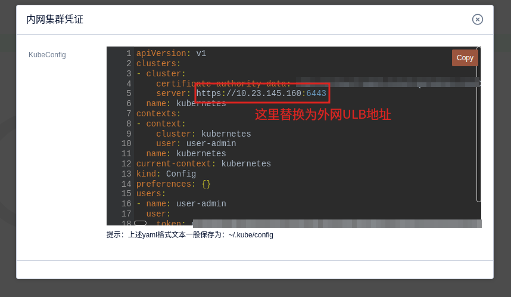

# 手动增加外网凭证

如果您在创建集群的时候，没有打开`外网APIServer`选项，您会发现在集群管理没有外网凭证，也就无法通过外网访问APIServer了。

在这种情况下，您可以手动为集群加上外网凭证。本文将会介绍详细步骤。

> 注意，增加外网凭证需要重启master节点的apiserver，请在业务低谷期操作。

## 创建ULB

**注意事项：由于该外网 ULB 不是随 UK8S 一起创建的，所以并不会在 UK8S 集群删除后同步删除，应当手动删除该 ULB**

您需要手动创建一个外网ULB以用于访问master节点。

在“负载均衡 ULB”页面点击创建“创建负载均衡”，选择负载均衡类型为“请求代理型”，选择网络模式为“外网”，选择所属 VPC 为 UK8S 集群所在的 VPC，选择弹性 IP 相关配置后进行创建，如下图所示：



## 创建VServer

先找到 UK8S **内网 APIServer** 所使用的 ULB，并记下其名称，本例中为“uk8s-cx13ag67xdh-master-ulb4”：



在步骤 1 创建的外网 ULB 详情页中，点击“VServer管理”后， 点击“创建 VServer”，选择协议和端口为“TCP”协议和 6443 端口，选择服务节点为“从其他VServer复制”，选择 ULB 实例为内网 APIServer 所使用的 ULB，填写其他创建参数后进行创建，如下图所示。



创建之后，可在 VServer 详情的服务节点页面看到三台 master 节点的健康检查状态变为“正常”，如下图：



## 重新生成SSL证书

**注意，下面的操作需要到3个master节点都执行一次**

记下上面创建的外网ULB的EIP：



这里假设EIP为`99.99.99.99`。

通过ssh登录到master节点，安装SSL证书工具：

```bash
curl -L -o cfssl https://pkg.cfssl.org/R1.2/cfssl_linux-amd64
curl -L -o cfssljson https://pkg.cfssl.org/R1.2/cfssljson_linux-amd64
chmod +x cfssl*
sudo mv cfssl* /usr/local/bin/
```

继续在刚才已安装工具的 master 节点，查询当前 APIServer 服务的 SSL 证书信息：

```bash
openssl x509 -noout -text -in /etc/kubernetes/ssl/kube-apiserver.pem | grep DNS
```

你应该可以看到这样的输出：

```
 DNS:kubernetes, DNS:kubernetes.default, DNS:kubernetes.default.svc, DNS:kubernetes.default.svc.cluster, DNS:kubernetes.default.svc.cluster.local, IP Address:127.0.0.1, IP Address:172.16.0.1, IP Address:10.23.145.160, IP Address:10.23.151.92, IP Address:10.23.76.232, IP Address:10.23.226.61
```

记下上面所有的地址。

下面，在任意位置创建一个`kube-apiserver-csr.json`文件，将上面所有的内网地址，以及你的ULB外网地址加到文件中：

```json
{
    "CN": "kubernetes",
    "hosts": [
        "127.0.0.1",
        
        // 这里替换为刚刚通过openssl命令输出的IP地址
        "172.16.0.1",
        "10.23.145.160",
        "10.23.151.92",
        "10.23.76.232",
        "10.23.226.61",
        
        // 这里替换为您刚刚创建的外网ULB的EIP地址
        "99.99.99.99",
        
        // 这里替换为openssl命令输出的DNS
        "kubernetes",
        "kubernetes.default",
        "kubernetes.default.svc",
        "kubernetes.default.svc.cluster",
        "kubernetes.default.svc.cluster.local"
    ],
    "key": {
        "algo": "rsa",
        "size": 2048
    },
    "names": [{
        "C": "CN",
        "ST": "BeiJing",
        "L": "BeiJing",
        "O": "k8s",
        "OU": "System"
    }]
}
```

**在替换之后，记得把json文件中的注释删除。**

再创建一个文件`ca-config.json`，添加如下内容：

```json
{
    "signing": {
        "default": {
            "expiry": "87600h"
        },
        "profiles": {
            "kubernetes": {
                "usages": [
                    "signing",
                    "key encipherment",
                    "server auth",
                    "client auth"
                ],
                "expiry": "87600h"
            }
        }
    }
}
```

先备份一下之前的ssl证书：

```bash
cp -r /etc/kubernetes/ssl /etc/kubernetes/ssl-back
```

执行下面的命令生成证书：

```bash
cfssl gencert -ca=/etc/kubernetes/ssl/ca.pem -ca-key=/etc/kubernetes/ssl/ca-key.pem -config=ca-config.json -profile=kubernetes kube-apiserver-csr.json | cfssljson -bare /etc/kubernetes/ssl/kube-apiserver
```

用下面的命令验证外网IP已经被加上去了（注意把`99.99.99.99`替换为您自己的外网IP）：

```bash
openssl x509 -noout -text -in /etc/kubernetes/ssl/kube-apiserver.pem | grep '99.99.99.99'
```

重启apiserver，以让证书生效：

```bash
systemctl restart kube-apiserver
```

通过 kubectl 访问外网 APIServer 的步骤和访问内网 APIServer 一致，可在 UK8S 集群详情页复制“内网凭证”，并修改当中的 server 字段，把内网 IP 地址改为 ULB 的外网 IP 地址，如下图：



通过这个凭证您就可以在外网访问集群了。