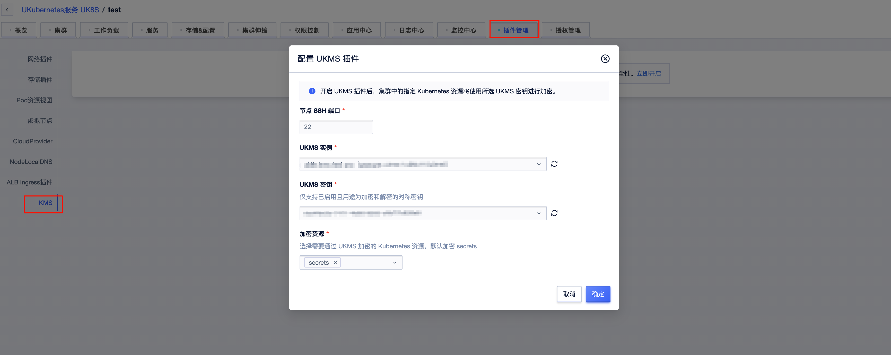
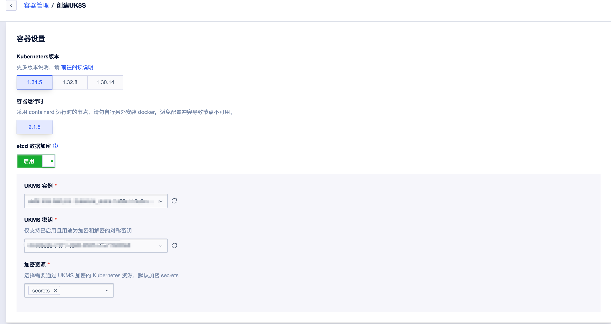

# ETCD 数据加密

## 概述

Kubernetes 会把 Secret、ConfigMap 等资源的内容保存在 ETCD 中，默认情况下这些数据是**明文**存储的。这意味着任何能够读取 ETCD 数据文件或 ETCD 备份的人，都可以直接拿到集群里的密码、证书、Token 等敏感信息。

UK8S 支持对接 [UKMS](https://console.ucloud.cn/ukms/manage)，通过 Kubernetes 原生的 KMS 静态加密（Encryption at Rest）机制，将 ETCD 中的数据加密后再落盘，开启后默认加密 Secret 资源。

- 仅 **1.30及以上**版本的集群支持，使用 **KMS v2** 驱动
- 加密只对**写入**生效，开启前已存在的存量数据仍是明文，需要参考[存量数据加密](#存量数据加密)重写一遍

## 加密原理

KMS 驱动采用**信封加密**（Envelope Encryption）模型：

1. 数据本身由**数据加密密钥**（DEK，Data Encryption Key）加密后写入 ETCD；
2. DEK 由**密钥加密密钥**（KEK，Key Encryption Key）加密，KEK 保存在远端的 UKMS 中，不落到集群本地；
3. kube-apiserver 通过 UNIX 域套接字以 gRPC 调用运行在 Master 节点上的 KMS 插件，由插件负责与 UKMS 通信完成 KEK 的加解密。

KMS v2 相比已弃用的 KMS v1 有明显的性能优势：v2 **每次加密**都会生成新的 DEK，由 kube-apiserver 使用密钥派生函数（KDF）基于一个秘密种子加随机数据派生出一次性 DEK，种子随 KEK 轮换而轮换；解密时 DEK 会以明文缓存，无需反复调用远端 KMS。

> 由于 KEK 保存在 UKMS 中，**一旦密钥被删除或禁用，kube-apiserver 将无法解密 ETCD 中的数据，集群会不可用且无法恢复**。请务必妥善保管密钥。

## 使用前提

- 集群版本为1.30及以上
- 在 [UKMS 控制台](https://console.ucloud.cn/ukms/manage)中创建 KMS 实例，并创建一个**具备加解密能力**的密钥
- KMS 实例与 UK8S 集群处于同一地域

## 开启加密

支持两种开启方式，两种方式都默认加密 Secret：

- **创建集群时开启**：在创建集群页面勾选 ETCD 数据加密，并选择已创建好的 KMS 密钥



- **插件中心开启**：对已有集群，在集群详情页的插件中心中安装 KMS 插件并选择密钥



开启后，UK8S 会在各 Master 节点上部署 KMS 插件

## 验证加密是否生效

加密只在写入时生效，因此需要用**新建**的 Secret 来验证。

1. 创建一个测试 Secret：

```bash
kubectl create secret generic secret1 -n default --from-literal=mykey=mydata
```

2. 登录任一 Master 节点，直接从 ETCD 中读取这条数据：

```bash

set -a
source /etc/etcd/etcd.conf
set +a
unset ETCDCTL_API

etcdctl get /registry/secrets/default/secret1 | hexdump -C
```

3. 如果输出中数据以 `k8s:enc:kms:v2:` 开头，说明 KMS 驱动已经对数据完成加密；若看到的是 `mykey`、`mydata` 等明文，则加密未生效。

4. 再通过 API 读取，确认能够被正常解密：

```bash
kubectl get secret secret1 -o jsonpath='{.data.mykey}' | base64 --decode; echo
```

5. 验证完成后清理测试数据：

```bash
kubectl delete secret secret1 -n default
```

## 存量数据加密

开启加密前写入的数据仍然是明文，需要对这些资源做一次“原地空更新”触发重写，从而应用服务端加密：

```bash
kubectl get secrets --all-namespaces -o json | kubectl replace -f -
```

注意事项：

- 如果因为写入冲突（资源版本变化）报错，重试该命令即可
- 集群规模较大时，建议按 Namespace 分批执行，避免一次性对 kube-apiserver 和 ETCD 造成过大压力
- 该操作会更新资源的 `resourceVersion`，可能触发监听这些资源的控制器做一次调谐，建议在业务低峰期执行

## 注意事项

- **不要删除或禁用正在被集群使用的 UKMS 密钥**，否则 kube-apiserver 无法解密 ETCD 数据，集群将不可用
- 开启加密后，ETCD 备份中的数据同样是密文，恢复时必须能够访问同一个 KMS 密钥，否则备份无法使用，参考 [ETCD 备份及恢复](/uk8s/administercluster/etcd_backup)
- KMS 插件不可用时，kube-apiserver 的健康检查端点 `/healthz/kms-providers` 会返回失败；此时集群对已加密资源的读写都会受影响
- 若需要关闭加密，**必须先把 `identity` 驱动调整为 `providers` 列表的第一项并重写全部资源，把数据解密回明文之后**，才能移除 KMS 驱动或删除密钥。直接卸载插件会导致已加密数据无法读取，建议提交工单由 UK8S 技术支持协助操作

## KMS 插件变更记录

| 版本            | 更新时间     | 更新内容            |
| --------------- | ------------ | --------------------|
| 2026.08.19      | 2026.08.19   | 支持 UKMS 加密 ETCD |

## 参考文档

- [使用 KMS 驱动进行数据加密](https://kubernetes.io/zh-cn/docs/tasks/administer-cluster/kms-provider/)
- [静态加密 Secret 数据](https://kubernetes.io/zh-cn/docs/tasks/administer-cluster/encrypt-data/)
- [解密已静态存储的数据](https://kubernetes.io/zh-cn/docs/tasks/administer-cluster/decrypt-data/)
