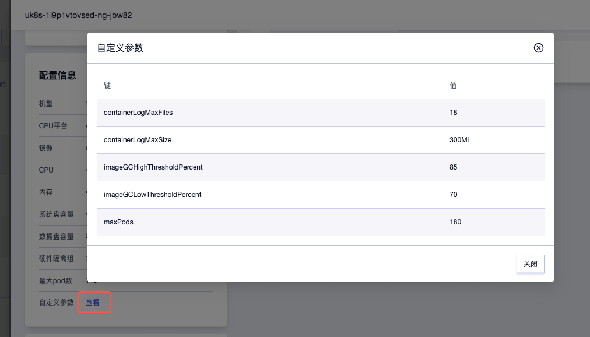

# 自定义节点的kubelet参数

当默认的kubelet配置无法满足业务需求时，您可以自定义节点的kubelet参数配置，调整节点行为。例如，您可以调整系统资源预留、自定义节点压力驱逐阈值、调整日志保留文件大小和时长等。

## 使用限制

> ⚠️️️️ 仅1.30及以上版本的UK8S集群支持自定义kubelet参数。

> ⚠️ 您只能在新增节点时(包括通过节点池或CA新增节点)应用自定义的kubelet参数，不能修改已有节点的自定义kubelet参数。

## 通过控制台自定义节点kubelet参数

您可以在添加节点、添加已有节点、添加节点池时选择`更多设置 - 自定义参数`来配置自定义的kubelet参数。

您可以在节点详情页、节点池详情页通过`配置信息 - 自定义参数`查看已配置的自定义kubelet参数。

## 自定义的kubelet参数说明

当前UK8S仅支持以下常用的配置项，您也可以参考 [官方文档](https://kubernetes.io/zh-cn/docs/reference/config-api/kubelet-config.v1beta1/) 了解以下参数的详细释义和用法。

| 配置项                      | 子配置项          | 说明                                                                               | 默认值 |
|-----------------------------|-------------------|------------------------------------------------------------------------------------|--------|
| containerLogMaxFiles        | /                 | 容器的日志文件个数上限，需大于等于2                                                | 5      |
| containerLogMaxSize         | /                 | 容器日志文件轮换生成新文件的最大阈值                                               | 10Mi   |
| evictionHard                | 👇                | 触发Pod驱逐操作的**硬性条件**，一旦条件满足会立即发起Pod驱逐                       | 👇      |
|                             | memory.available  | 内存剩余量                                                                         | 5%     |
|                             | imagefs.available | imagefs(可供容器运行时存储镜像和容器可写层)剩余量                                  | 15%    |
|                             | nodefs.available  | 节点文件系统剩余量                                                                 | 10%    |
|                             | nodefs.inodesFree | 文件系统inode剩余量                                                                | 5%     |
| evictionSoft                | 👇                | 触发Pod驱逐操作的**软性条件**，满足条件且持续时长超过指定的宽限期，可以触发Pod驱逐 | 👇      |
|                             | memory.available  | 内存剩余量                                                                         | 未设置 |
|                             | imagefs.available | imagefs(可供容器运行时存储镜像和容器可写层)剩余                                    | 未设置 |
|                             | nodefs.available  | 节点文件系统剩余量                                                                 | 未设置 |
|                             | nodefs.inodesFree | 文件系统inode剩余量                                                                | 未设置 |
| evictionSoftGracePeriod     | 👇                | 软驱逐条件对应的**宽限期**，单位为秒                                               | 👇      |
|                             | memory.available  | 内存剩余量驱逐宽限期                                                               | 未设置 |
|                             | imagefs.available | imagefs剩余量宽限期                                                                | 未设置 |
|                             | nodefs.available  | 节点文件系统剩余量宽限期                                                           | 未设置 |
|                             | nodefs.inodesFree | 文件系统inode剩余量宽限期                                                          | 未设置 |
| imageGCHighThresholdPercent | /                 | 镜像占用磁盘用量**超过**此百分比阈值时，镜像垃圾收集会一直运行                     | 85     |
| imageGCLowThresholdPercent  | /                 | 镜像占用磁盘用量**低于**此百分比阈值时，镜像垃圾收集操作不会执行                   | 70     |
| kubeReserved                | 👇                | 容器管理服务预留的各类资源，不可分配给Pod使用                                      | 👇      |
|                             | cpu               | cpu资源                                                                            | 100m   |
|                             | memory            | 内存资源                                                                           | 500Mi  |
|                             | ephemeral-storage | 磁盘容量                                                                           | 未设置 |
|                             | pid               | pid数量                                                                            | 未设置 |
| systemReserved              | 👇                | 系统预留的各类资源，不可分配给Pod使用                                              | 👇      |
|                             | cpu               | 系统预留的cpu资源                                                                  | 100m   |
|                             | memory            | 系统预留的内存资源                                                                 | 500Mi  |
|                             | ephemeral-storage | 系统预留的磁盘容量                                                                 | 未设置 |
|                             | pid               | 系统预留的pid数量                                                                  | 未设置 |

