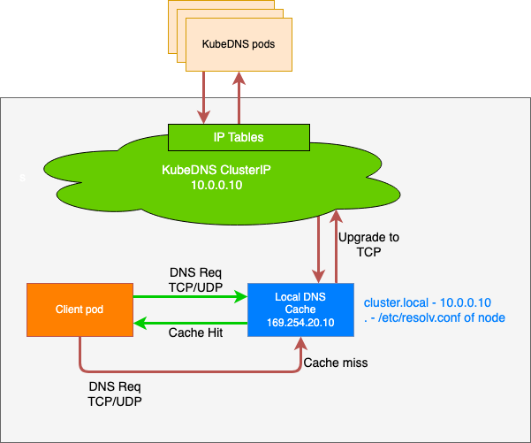

# NodeLocal DNSCache

默认情况下 DNS 的请求通过集群网络请求到`CoreDNS`中，NodeLocal DNSCache 通过在集群节点上作为 DaemonSet 运行 DNS 缓存代理来提高集群 DNS 性能，并解决DNAT的[conntrack竞争问题](https://github.com/kubernetes/kubernetes/issues/56903)

启用 NodeLocal DNSCache 之后，DNS 查询所遵循的路径如下：



## 安装NodeLocalDNS


## 使用方式

开启NodelocaDNS功能后，服务无法直接使用，需要通过注入标签来实现自动注Pod 配置来使用；

目前支持在 `Namespace`上实现标签注入，`Namespace`开启注入后，同一个`Namespace`下的服务都会开启Nodeloca DNSCache：

```shell
kubectl label namespace <namespace> node-local-dns-injection=enabled
```

当开启自动注入后，在Pod上会增加以下字段；为了最大程度上保证业务DNS请求高可用，`nameservers`字段中会额外加入 `kube-dns` 的ClusterIP地址作为备份的DNS服务器。

```yaml
dnsConfig:
  nameservers:
  - 169.254.20.10
  - 192.168.0.2 # kube-dns地址，根据集群网络配置会有所不同
  options:
  - name: ndots
    value: "3"
  - name: attempts
    value: "2"
  - name: timeout
    value: "1"
  searches:
  - default.svc.cluster.local
  - svc.cluster.local
  - cluster.local
dnsPolicy: None
```

#### Pod禁用Nodelocal DNSCache

如果Namespace开启了 DNSConfig 自动注入，需要对部分Pod进行豁免（即不进行注入），可以修改其Pod Template中Labels标签字段，加上`node-local-dns-injection=disabled`标签来试下：

```yaml
apiVersion: apps/v1
kind: Deployment
metadata:
  name: ubuntu
  namespace: default
spec:
  replicas: 1
  selector:
    matchLabels:
      app: ubuntu
  template:
    metadata:
      labels:
        app: ubuntu
        node-local-dns-injection: disabled # 不自动注入
    spec:
      containers:
      - name: ubuntu
        image: uhub.service.ucloud.cn/library/ubuntu:14.04.2
        command: ["/bin/bash", "-c", "--"]
        args: ["while true; do echo hello; sleep 10;done"]
```

#### 使用注意：

- kube-system和kube-public命名空间不支持标签注入。
- Pod的网络为hostNetwork时， DNSPolicy必须为ClusterFirstWithHostNet
- Pod为网络为非hostNetwork时，DNSPolicy必须为ClusterFirst

## 问题排查

### 长时间处于安装中

> 一般出现此问题是由于资源不足

- 执行以下命令检查这2个资源是否正常

```shell
kubectl -n kube-system get ds node-local-dns
kubectl -n kube-system get deployment nodelocaldns-webhook
```

- 如资源不正常则可以使用下面的命令来进一步诊断

```shell
kubectl -n kube-system describe ds node-local-dns
kubectl -n kube-system describe deployment nodelocaldns-webhook
```

## 参考链接

<https://kubernetes.io/zh-cn/docs/tasks/administer-cluster/nodelocaldns>
