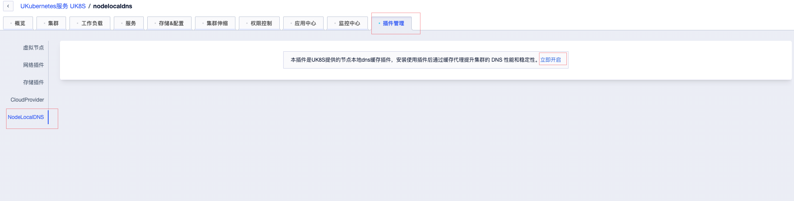
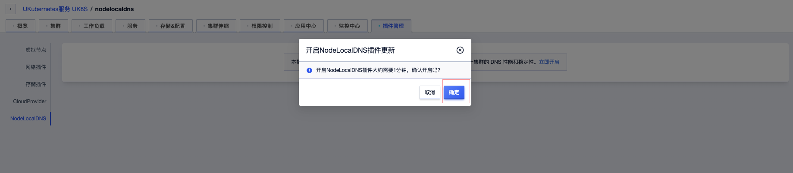
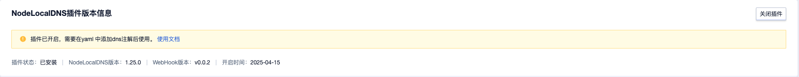

# NodeLocal DNSCache

默认情况下dns的请求通过集群网络请求到coredns中，nodelocaldns是以ds的形式在每个节点上部署一个dns，每个node上的pod访问本地的dns从而降低延迟

还可以解决DNAT的[conntrack竞争问题](https://github.com/kubernetes/kubernetes/issues/56903)

## 安装







## 使用方式

- 通过打上下面的标签来自动注入dns配置到pod中

```shell
kubectl label namespace <namespace> node-local-dns-injection=enabled
```

- 需要满足以下条件
  - Pod不位于kube-system和kube-public命名空间。
  - Pod所在命名空间的Labels`标签包含 node-local-dns-injection=enabled`。
  - Pod没有被打上禁用DNS注入`node-local-dns-injection=disabled`标签。
  - Pod的网络为hostNetwork且DNSPolicy为ClusterFirstWithHostNet，或Pod为非hostNetwork且DNSPolicy为ClusterFirst。
- 开启自动注入后，您创建的Pod会被增加以下字段，为了最大程度上保证业务DNS请求高可用，nameservers中会额外加入kube-dns的ClusterIP地址作为备份的DNS服务器。

```yaml
dnsConfig:
  nameservers:
  - 169.254.20.10
  - 192.168.0.2 # kube-dns地址，根据集群网络配置会有所不同
  options:
  - name: ndots
    value: "3"
  - name: attempts
    value: "2"
  - name: timeout
    value: "1"
  searches:
  - default.svc.cluster.local
  - svc.cluster.local
  - cluster.local
dnsPolicy: None
```

- 在命名空间DNSConfig自动注入开启的情况下，如需对部分Pod进行豁免（即不进行注入），可以修改其Pod Template中Labels标签字段，加上`node-local-dns-injection=disabled`标签。如下例子

```yaml
apiVersion: apps/v1
kind: Deployment
metadata:
  name: ubuntu
  namespace: default
spec:
  replicas: 1
  selector:
    matchLabels:
      app: ubuntu
  template:
    metadata:
      labels:
        app: ubuntu
        node-local-dns-injection: disabled # 不自动注入
    spec:
      containers:
      - name: ubuntu
        image: uhub.service.ucloud.cn/library/ubuntu:14.04.2
        command: ["/bin/bash", "-c", "--"]
        args: ["while true; do echo hello; sleep 10;done"]
```

## 问题排查

### 长时间处于安装中

> 一般出现此问题是由于资源不足

- 执行以下命令检查这2个资源是否正常

```shell
kubectl -n kube-system get ds node-local-dns
kubectl -n kube-system get deployment nodelocaldns-webhook
```

- 如资源不正常则可以使用下面的命令来进一步诊断

```shell
kubectl -n kube-system describe ds node-local-dns
kubectl -n kube-system describe deployment nodelocaldns-webhook
```

<https://kubernetes.io/zh-cn/docs/tasks/administer-cluster/nodelocaldns>
