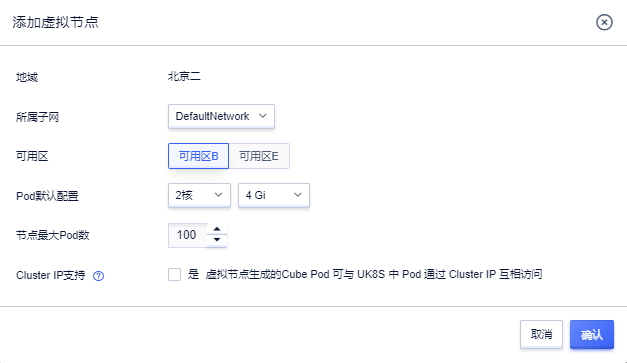
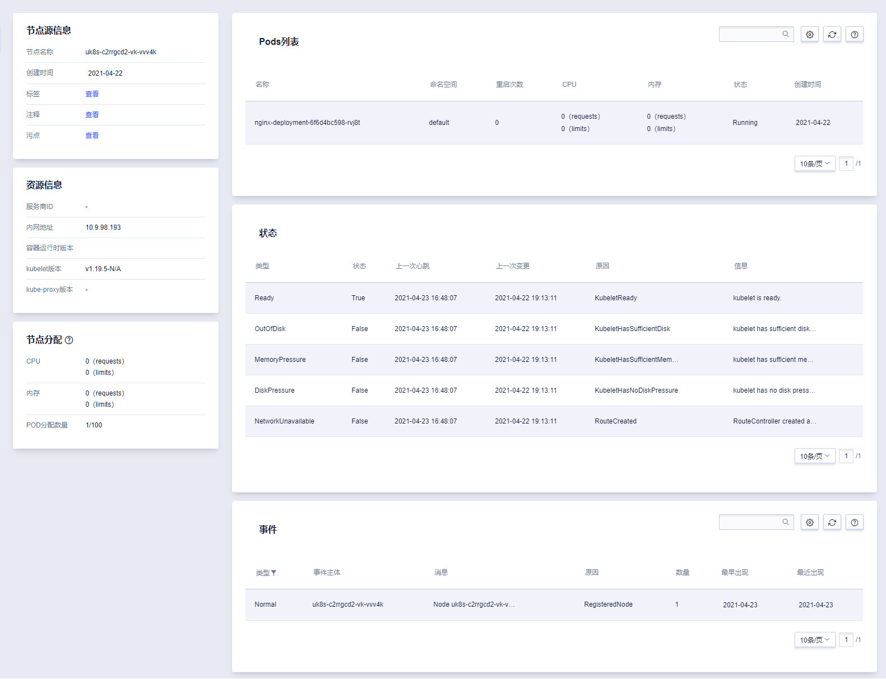

# Virtual Kubelet 虚拟节点

[Virtual Kubelet](https://virtual-kubelet.io/) 是 Kubernetes 社区的重要开源项目，基于 Virtual Kubelet 虚拟节点组件，可以实现 UCloud 两大容器产品 UK8S 和 Cube 的无缝对接，用户在 UK8S 集群中可通过 VK 组件创建 [Cube 容器实例](/cube/README)，每个 Cube 实例被视为 VK 节点上的一个Pod。

## 添加虚拟节点

在集群节点列表页，点击「添加虚拟节点」按钮，为 UK8S 集群添加虚拟节点，当前一个 UK8S 集群支持最多添加 8 个虚拟节点，所添加的虚拟节点名称为 **uk8s-xxxxxxxx-vk-xxxxx**，该名称将被注册为虚拟节点的 **spec.nodeName**，其中 **uk8s-xxxxxxxx** 为 UK8S 集群 ID，末五位为随机生成的数字字母组合。



| 字段 | 说明 |
|-----|-------|
|地域|VK 节点所属地域，即 UK8S 集群所在地域，不可更改。|
|所属子网|VK 节点及生成的 Cube Pod 所在子网，默认为 UK8S 集群 Master 节点所在子网。|
|可用区|VK 节点及生成的 Cube Pod 所在可用区，<br>当前 Cube 支持可用区：北京二B/E，上海二A，广州B，香港B，东京A。|
|Pod 默认配置|不指定资源 requests 情况下，VK 节点生成的 Cube Pod 的默认资源配置。|
|节点最大 Pod 数|节点最大可以创建的 Cube Pod 数量，当前支持最多 200 个 Cube Pod。|
|Cluster IP 支持|虚拟节点生成的 Cube Pod 可与 UK8S 中 Pod 通过 Cluster IP 互相访问。<br>当 Cube 急剧扩容时，开启该功能会导致 UK8S ApiServer 压力急剧上升。对无需使用 K8S Service 转发能力的容器，建议不开启该功能。|

## 虚拟节点管理

### 节点描述

VK 节点与普通 Node 节点一样，是 UK8S 集群当中的一个 Node 对象。[命令行管理时](/uk8s/manageviakubectl/intro_of_kubectl)可使用 `kubectl get nodes` 等命令进行节点的管理、查看，在集群列表页点击「节点描述」按钮，亦可查看 VK 节点详细信息、节点状态、节点生成的 Cube Pod 及节点事件。



### 禁用及删除

您可以在控制台页面，进行 VK 节点的禁用和删除，禁用 VK 节点后应用将不能够通过 VK 节点创建 Cube 实例，现有通过 VK 节点创建的 Cube 实例将被保留。删除 VK 节点时，通过 VK 节点创建的 Cube 实例及所挂载的UDisk 将会被默认删除。

## 通过虚拟节点创建 Cube 实例

通过 VK 节点创建 Cube 实例的方式，与普通 Pod 资源类似，但需要在 yaml 文件 Pod spec 中添加 nodeName 指定 VK 节点并添加污点容忍：

```yaml
nodeName: uk8s-xxxxxxxx-vk-xxxxx           # 指定节点名称
tolerations:                               # 添加污点容忍
  - effect: NoSchedule
    key: virtual-kubelet.io/provider
    operator: Equal
    value: ucloud
```
创建 Cube 实例时，需注意特定 CPU / 内存规格有一定的比例及限制，VK 支持创建 Cube 规格配置如下：

| CPU | 内存 |
|-----|-----|
|500m|512Mi/1Gi/2Gi|
|1|1Gi/2Gi/4Gi|
|2|2Gi/4Gi/8Gi|
|4|4Gi/8Gi/16Gi|
|8|8Gi/16Gi|