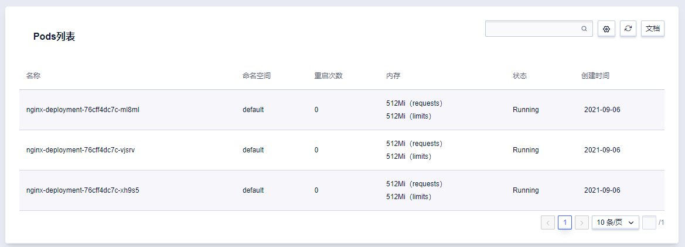
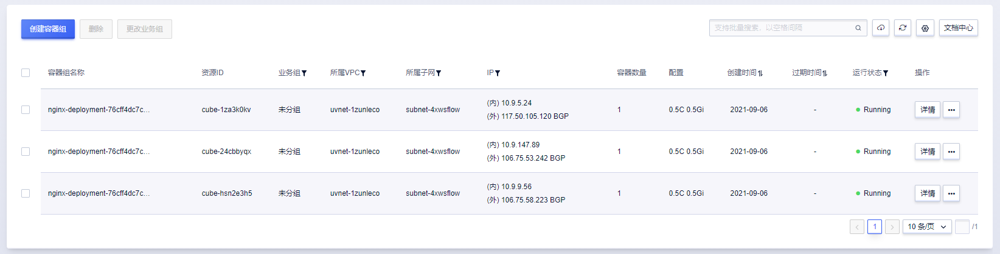
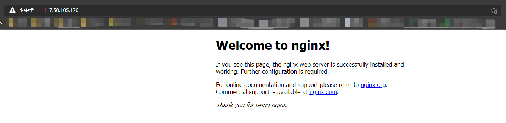
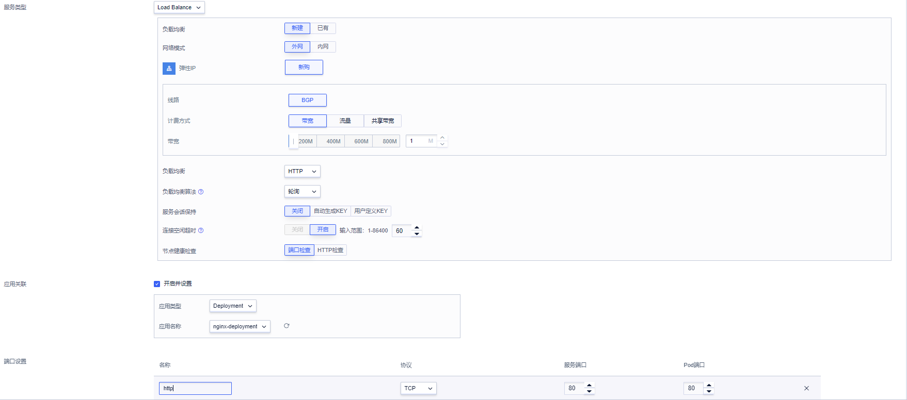
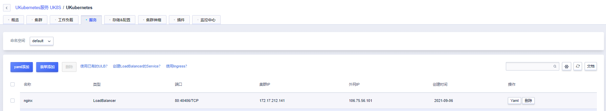
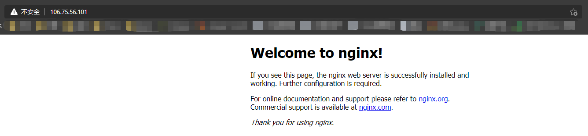

# 2. 通过 Virtual Kubelet 虚拟节点批量创建 Nginx 网关

[Virtual Kubelet](https://virtual-kubelet.io/) 是 Kubernetes 社区的重要开源项目，基于 Virtual Kubelet 虚拟节点组件，可以实现 UCloud 两大容器产品 UK8S 和 Cube 的无缝对接，用户在 UK8S 集群中可通过 VK 组件创建 [Cube 容器实例](/cube/README)，每个 Cube 实例被视为 VK 节点上的一个Pod。

## 添加虚拟节点

在集群节点列表页，点击「添加虚拟节点」按钮，为 UK8S 集群添加虚拟节点，当前一个 UK8S 集群支持最多添加 8 个虚拟节点，所添加的虚拟节点名称为 **uk8s-xxxxxxxx-vk-xxxxx**，该名称将被注册为虚拟节点的 **spec.nodeName**，其中 **uk8s-xxxxxxxx** 为 UK8S 集群 ID，末五位为随机生成的数字字母组合。


| 字段 | 说明 |
|-----|-------|
|地域|VK 节点所属地域，即 UK8S 集群所在地域，不可更改。|
|所属子网|VK 节点及生成的 Cube Pod 所在子网，默认为 UK8S 集群 Master 节点所在子网。|
|可用区|VK 节点及生成的 Cube Pod 所在可用区，<br>当前 Cube 支持可用区：华北一B/E，上海二A，广州B，香港B，东京A。|
|Pod 默认配置|不指定资源 requests 情况下，VK 节点生成的 Cube Pod 中单个 Container 的默认资源配置。|
|节点最大 Pod 数|节点最大可以创建的 Cube Pod 数量，当前支持最多 200 个 Cube Pod。|
|Cluster IP 支持|虚拟节点生成的 Cube Pod 可与 UK8S 中 Pod 通过 Cluster IP 互相访问。<br>当 Cube 急剧扩容时，开启该功能会导致 UK8S ApiServer 压力急剧上升。对无需使用 K8S Service 转发能力的容器，建议不开启该功能。|

## 通过虚拟节点创建 Cube 实例部署 Nginx 业务

在 UK8S 控制台**工作负载**页面**Deployment**子页，即可通过 yaml 及表单的方式添加 Deployment 控制器。

通过 VK 节点创建 Cube 实例的方式，与普通 Pod 资源类似，但需要在 yaml 文件 Pod spec 中添加 nodeName 或 nodeSelector 指定 VK 节点并添加污点容忍。支持直接创建 Pod，或通过 Deployment 及 StatefulSet 等控制器进行 Pod 的管理。

```yaml
apiVersion: apps/v1
kind: Deployment
metadata:
  name: nginx-deployment
  labels:
    app: nginx
spec:
  replicas: 3
  selector:
    matchLabels:
      app: nginx
  template:
    metadata:
      # 为每个 Cube 实例绑定 1M 的外网 EIP
      annotations:
        cube.ucloud.cn/cube-eip: "true"
        cube.ucloud.cn/cube-eip-bandwidth: "1"
      labels:
        app: nginx
    spec:
      containers:
      - name: nginx
        image: uhub.service.ucloud.cn/ucloud/nginx:latest
        resources:
          requests:
            cpu: "500m"
            memory: "512Mi"
        ports:
        - containerPort: 80
      # 通过 nodeSelector 调度到 VK 节点，也可以自己为 VK 节点添加其他标签
      nodeSelector:
        type: virtual-kubelet  
      # 添加节点容忍
      tolerations:                               
      - effect: NoSchedule
        key: virtual-kubelet.io/provider
        operator: Equal
        value: ucloud
```

Deployment 创建成功后，我们可以在 UK8S 控制台**集群**页面**节点**列表页，找到相应的 VK 节点，点击**节点描述**按钮，可以看到已经有三个 Nginx Pod 被调度到相应的虚拟节点上。



在 Cube 控制台页面，我们可以看到已经创建了三个与 Pod 名称相对应的 Cube 实例，并绑定了外网 EIP。在浏览器中输入相应的 EIP，我们可以看到一个 Nginx 服务已经完成部署。





# 3. 通过外网 ULB 访问 UK8S Service

在上一个实验中，我们已经在 UK8S 集群中创建了一个 Deployment，并通过 Virtual Kubelet，创建了相应的 Cube 实例，接下来，我们将通过 Kubernetes 集群中 LoadBalance 类型的 Service，及 UCloud ULB 负载均衡，将服务暴露出去。

在 UK8S 控制台**服务**页面，点击**表单创建**，创建相应的服务。

* 服务类型选择**Load Balance**
* 负载均衡选择**新建**，即创建新的 ULB 负载均衡
* 选择 1M BGP 带宽
* 选择负载均衡类型为 HTTP（七层）
* 在**应用关联**处选择刚创建的 **nginx-deployment**



点击确定，我们可以看到集群中已经创建了相应的 Service，并绑定了负载均衡及外网 IP，通过相应的外网 IP，我们可以通过负载均衡 ULB 访问我们刚刚部署的 Nginx 服务


