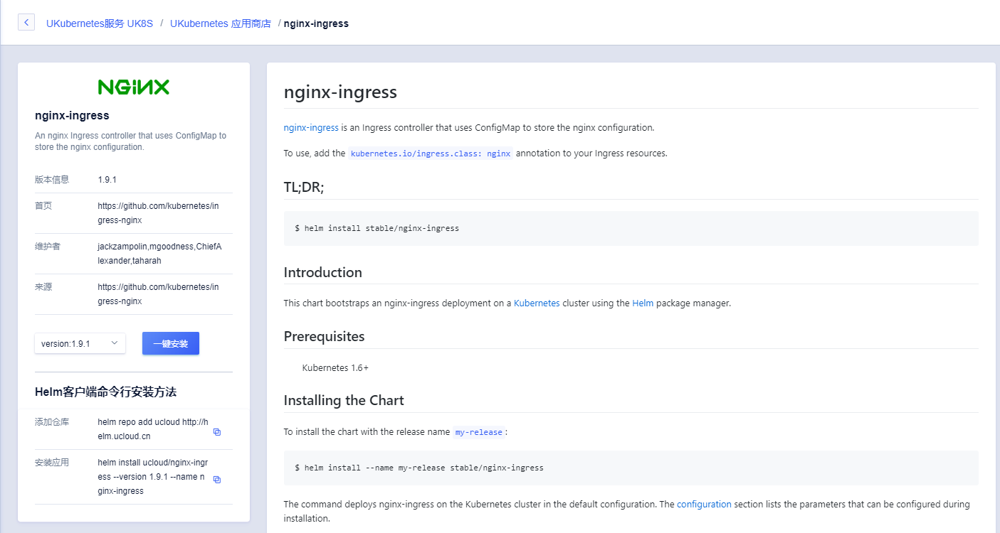
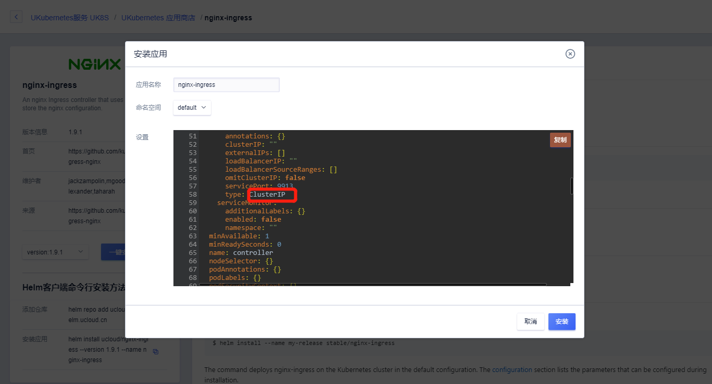
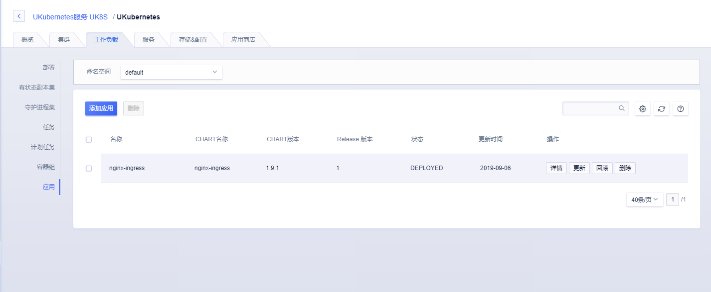
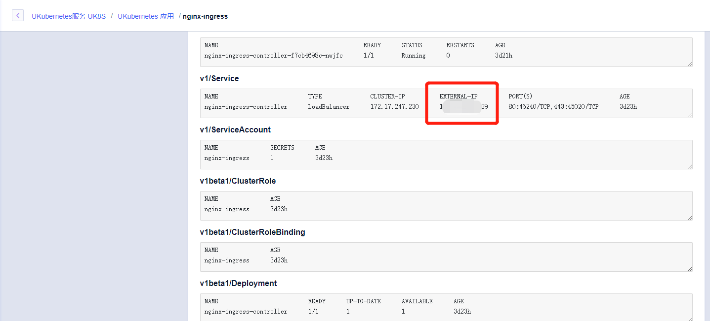
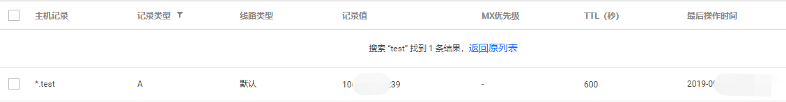
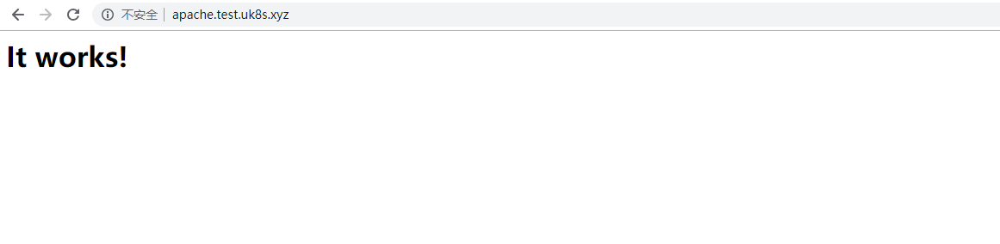

{{indexmenu_n>35}}
## 一键安装应用


### 通过控制台进行安装应用

UK8S应用商店功能提供了一键安装功能，具体操作如下：


1. 点击进入UK8S集群，选择应用商店，选择需要使用的应用点击进入



2. 点击一键安装，对应用提供的相关设置进行修改.

例如nginx-ingress应用，这里默认的service.type为LoadBalancer，如不需要提供外网ingress服务可以修改为ClusterIP；defaultBackend.enabled需要设置为false。




3. 安装完成会提示跳转到工作负载中进行应用的查看。



4. 点击应用进入详情可以查看到nginx-ingress的详细信息，



### 测试安装的应用

这里我们通过一个简单示例验证刚刚创建的nginx-ingress。nginx-ingress的详细用法可参考[Nginx Ingress](../service/ingress/nginx)

**添加解析**

通过nginx-ingress的详情页面我们看到了ingress-controller的service，其中EIP添加到您的DNS解析中或者写入到本地hosts。




**创建服务**

创建一个简单的应用服务。如下两条命令我们创建了一个1副本的apache服务，这里服务采用的ClusterIP在集群内部提供访问。

```
kubectl run apache --image=httpd --replicas=1 --port=8080
kubectl expose deployment apache --port=80 --type=ClusterIP
```

**建立ingress连接**

创建一个Ingress。我们这里声明了apache.test.uk8s.xyz这个地址对应一个叫apache的svc，端口80，也就是我们上一步骤中创建的apache的svc。

```
apiVersion: extensions/v1beta1
kind: Ingress
metadata:
  annotations:
    kubernetes.io/ingress.class: nginx
  name: uapache-ingress
  namespace: default
spec:
  rules:
  - host: apache.test.uk8s.xyz
    http:
      paths:
      - backend:
          serviceName: apache
          servicePort: 80
        path: /
```

**查看链接**

我们可以访问apache.test.uk8s.xyz进行查看，可以看到了nginx-ingress可以正常的提供服务了。

