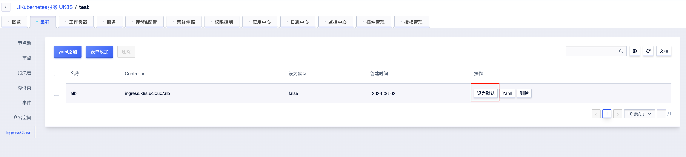

# Ingress 支持

## ALB Ingress

ALB Ingress 是使用 UCloud ALB 实现的一个 Ingress 控制器，请参考 [ALB Ingress](/uk8s/service/ingress/alb_ingress.md)。

## Nginx Ingress

不同版本的 Kubernetes 安装配置方法有所不同。

> 注意：官方已在2026年3月[停止维护](https://kubernetes.io/zh-cn/blog/2025/11/11/ingress-nginx-retirement/)。

> Nginx Ingress 较低版本存在一些安全漏洞，详见 [Ingress-Nginx Controller 漏洞公告](/uk8s/vulnerability/CVE-2025-1974.md)，如果您的 Kubernetes 版本在1.13 - 1.25并且需要安装 Nginx Ingress，建议以最小权限管理 Nginx Ingress。

如果您的 Kubernetes 版本为1.26及以上，请参考 [Kubernetes Nginx Ingress 安装配置说明 (1.26 ~ latest)](/uk8s/service/ingress/nginx_1.26)。

如果您的 Kubernetes 版本为1.19 ~ 1.25，请参考 [Kubernetes Nginx Ingress 安装配置说明 (1.19 ~ 1.25)](/uk8s/service/ingress/nginx_1.19)。

如果您的 Kubernetes 版本为1.13 ~ 1.18，请参考 [Kubernetes Nginx Ingress 安装配置说明 (1.13 ~ 1.18)](/uk8s/service/ingress/nginx)。

如果您想了解 Ingress 的高级用法，请参考 [Ingress 高级用法](/uk8s/service/ingress/multiple_ingress)。

## IngressClass

Ingress 可以由不同的控制器实现，通常使用不同的配置。每个 Ingress 应当指定一个类，也就是一个对 IngressClass 资源的引用。IngressClass 资源包含额外的配置，其中包括应当实现该类的控制器名称。

### 设置默认 IngressClass

可以将一个特定的 IngressClass 标记为集群默认 Ingress 类。

>⚠️注意：
>如果集群中有多个 IngressClass 被标记为默认，准入控制器将阻止创建新的未指定 ingressClassName 的 Ingress 对象。解决这个问题需要确保集群中最多只能有一个 IngressClass 被标记为默认。

#### 控制台设置

#### YAML 手动注解

将某个 IngressClass 资源的 `ingressclass.kubernetes.io/is-default-class` 注解设置为 true 将确保新的未指定 `ingressClassName` 字段的 Ingress 能够被赋予这一默认 IngressClass。
