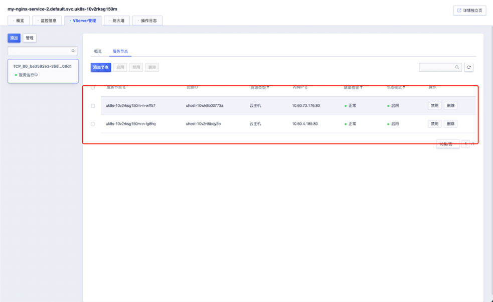
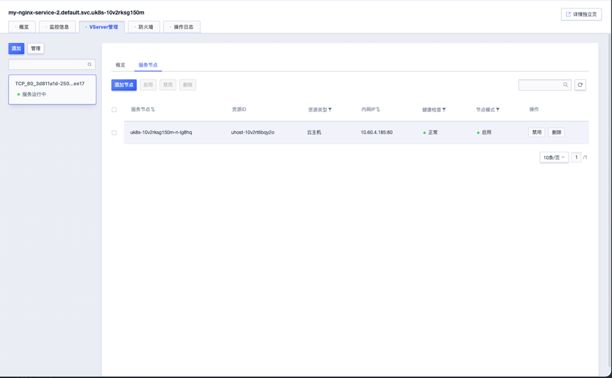

## service的extenalTrafficPolicy 和 internalTrafficPolicy 参数


###  [svc 流量策略](https://kubernetes.io/zh-cn/docs/reference/networking/virtual-ips/#traffic-policies) 

* extenalTrafficPolicy: 


```markdown
  * 作用： 用于控制外部流量的行为，通常来自集群外部。默认情况下，源 IP 会做 SNAT，pod 看到的源 IP 是 Node IP
  * 选项：
     - Local:        只将IP包转发到在本机上运行的服务Pod。
                     如果接收流量的节点没有服务的 Pod，则流量将被丢弃。
                     这保留了客户端的源 IP，但如果特定节点具有更多活动连接，则可能导致负载分布不均匀

     - Clusetr(默认)：流量被路由到集群中的任何节点，无论该节点是否具有正在运行的服务Pod。
                     如果节点没有服务的 Pod，则流量将转发到有服务的 Pod 的节点。
                     这会导致客户端的源 IP 被节点的 IP 屏蔽，但它可确保所有节点上的负载均匀分布
  
  * 使用：
   - Local:          当保留源 IP 至关重要时，例如出于日志记录或安全目的
   - Cluster:        当不需要保留源 IP 并且希望均匀分布负载时

```


* internalTrafficPolicy：

```markdown
  * 策略： 来控制来自内部源的流量如何被路由，处理来自集群内部的流量
  * 选项： 
    - Cluster(默认)：   会将内部流量路由到所有准备就绪的服务端点

    - Local :          这告诉 kube-proxy 只使用节点本地的端点来处理集群内部的流量。
                       将字段设置为 Local 仅会将流量路由到本地节点准备就绪的端点
                       如果流量策略为 Local 但没有本地节点端点，那么 kube-proxy 会丢弃该流量
  * 使用：
    - Cluster(默认)： 集群内所有节点都可正常访问该service
    - Local：        开启内网网络策略之后，即使其他 Node 上面有正常工作的 Endpoints，只要 Node 本地没有正常运行的 Pod，在node本地，该 Service 就无法访问

```


* 对于uk8s的ULB

```markdown
1. externalTrafficPolicy: Cluster  
   ULB的VServer 中的服务节点会包含集群中所有node节点，不论 pod是否运行在该节点,
   在此状态下，集群内其他节点访问ULB 的ip，正常访问

```




```markdown
2. externalTrafficPolicy: Local
   ULB的VServer 中的服务节点只会包含集群中该svc 关联 pod 所在的node节点,
   在此状态下，集群内其他节点，在节点上直接访问ULB 的ip，无法把流量传到LB，一般不通；特殊情况： 访问服务节点与ULB的后端服务在同一个节点上,
   集群其他节上的pod 通过ULB的ip 正常访问

```

