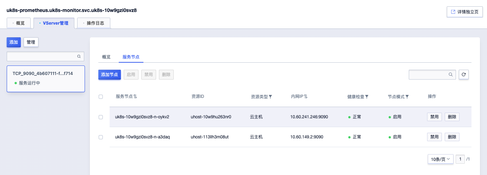

# Service 流量策略

Service 的流量策略：外部流量策略和内部流量策略，分别用来控制从外部源路由的流量和控制来自内部源的流量如何被路由; 你可以设置`.spec.externalTrafficPolicy`和`.spec.internalTrafficPolicy` 字段来控制 Kubernetes 如何将流量路由到健康（“就绪”）的后端。
  
官方文档参考[这里](https://kubernetes.io/zh-cn/docs/reference/networking/virtual-ips/#traffic-policies)

## extenalTrafficPolicy 

extenalTrafficPolicy用于控制外部流量的如何被路由，有效值为 Cluster 和 Local。通常来自集群外部请求，默认情况下，源 IP 会做 SNAT，Pod 看到的源 IP 是 Node IP。

* Cluster（默认）：
   - 使用此值时，流量被路由到集群中的任意节点，无论该节点是否具有正在运行的服务Pod。如果节点没有服务的Pod，流量会被转发到有服务的 Pod 的节点。
   - 使用此值时，会导致客户端的源 IP 被节点的 IP 屏蔽，如不需要保留源 IP 时可选择此有效值。

* Local：
   - 使用此值时，只将IP包转发到在本机上运行的服务Pod。如果接收流量的节点没有服务的 Pod，则流量将被丢弃。
   - 使用此值时，保留了客户端的源 IP。当保留源 IP 至关重要时，例如出于日志记录或安全目的，可选此值。

## internalTrafficPolicy

internalTrafficPolicy用于控制来自内部源的流量如何被路由，处理来自集群内部的流量，有效值为 Cluster 和 Local。
 
*  Cluster(默认)：   
   - 使用此值时，在所有节点访问内部流量都可以访问，如果节点上没有服务Pod，会将内部流量转发到有准备就绪的服务Pod的节点。
   - 使用此值时，会导致客户端的源 IP 被节点的 IP 屏蔽，如不需要保留源 IP 时可选择此有效值。

* Local :          
   - 使用此值时，节点仅会将流量路由到本地节点上准备就绪的服务Pod，如果节点没有访问服务Pod，节点会丢弃该流量。
   - 开启内网网络策略之后，即使其他节点上面有正常工作的服务Pod，在自己的节点如果没有准备就绪的服务Pod，流量也是无法正常转发。

## ULB中流量策略

#### externalTrafficPolicy: Cluster  

当选择Cluster有效值时，不论Pod是否运行在该节点，ULB的VServer中的服务节点会包含集群中所有node节点；在这种情况下集群内其他节点也可以正常访问ULB的IP。

在一个集群内有2个节点，服务只部署一个实例Pod，查看ULB可以看到VServer的服务节点有2个。

#### externalTrafficPolicy: Local

当选择Local值时，ULB的VServer 中的服务节点只会包含集群中服务Pod所在的node节点。

注意集群内服务访问ULB的IP时，请求会直接在集群内被转发而不会发送到ULB。因此Local模式下，仅当需要访问Service的客户端Pod与Service的后端服务在同一个节点上时，可以成功访问。其他节点上的Pod均无法访问ULB IP。

可以看到当Service的externalTrafficPolicy设置为Local时，ULB的后端只有一个节点。

