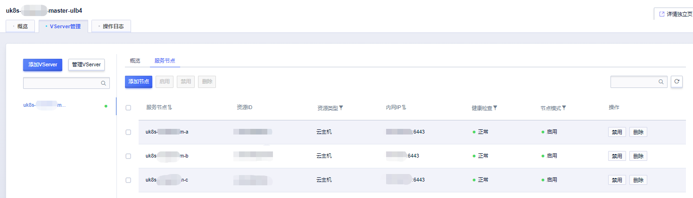

## 集群 ULB 误删处理

负载均衡（ULB）分内网和外网两种，在误删情况下，首先需要重建 ULB，并且保证原 ULB IP 地址不变

* 对于内网 ULB，需要联系技术支持，非标创建指定内网 IP 的 ULB；
* 对于外网 ULB，需要联系技术支持创建指定 EIP 的 ULB（前提是原有 EIP 未被其他客户申请）。

### Master ULB 误删

Master ULB，即集群 APIServer 绑定的 ULB，用于访问三台 Master 节点上 APIServer，内网 Master ULB 在创建集群时自动生成，如创建时开启外网 APIServer 则同时生成外网 Master ULB。
该 ULB 明明规则为 uk8s-xxxxxxxx-master-ulb4（内网 ULB）/ uk8s-xxxxxxxx-master-ulb4-external（外网 ULB）。

1. 创建 ULB 时类型需要指定为报文转发型

2. 新建端口为 6443 的 VServer，指定类型为 TCP

3. 添加三台 Master 节点为服务节点

### 集群 Service ulb 误删

1. 创建 ULB 时 ULB 类型需要与 Service 的类型相匹配，服务类型为 TCP/UDP 时指定报文转发，为 HTTP/HTTPS 时指定请求代理类型）

2. 删除集群内原 Service

3. 根据文档重新绑定 ULB 和 Service：[使用已有ULB创建服务](/uk8s/service/ulb_designation)