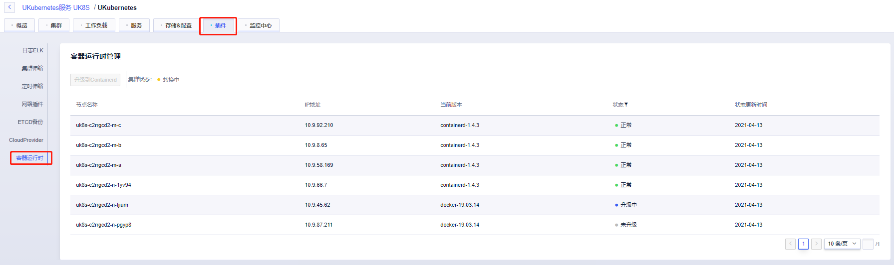

## Docker 和Containerd 容器引擎

在UK8S中新建V1.19以后的Kubernetes版本，其容器引擎已经默认更换为Containerd，1.19之前的Kubernetes则为Docker。 这两种容器引擎都有各自的命令工具来管理镜像和容器。

两种容器引擎常用命令及对比如下：

### 镜像管理命令对比

|镜像相关功能|	Docker|	Containerd|
|----------|---------|----------|
|显示本地镜像列表|	docker images|	crictl images|
|下载镜像|	docker pull|	crictl pull|
|上传镜像|	docker push|	无|
|删除本地镜像|	docker rmi|	crictl rmi|
|查看镜像详情|	docker inspect IMAGE-ID|	crictl inspecti IMAGE-ID|

### 容器管理命令对比

|容器相关功能|	Docker|	Containerd|
|----------|---------|----------|
|显示容器列表|	docker ps|	crictl ps|
|创建容器|	docker create|	crictl create|
|启动容器|	docker start|	crictl start|
|停止容器|	docker stop|	crictl stop|
|删除容器|	docker rm	|crictl rm|
|查看容器详情|	docker inspect|	crictl inspect|
|attach|	docker attach|	crictl attach|
|exec	|docker exec|	crictl exec|
|logs|	docker logs	|crictl logs|
|stats|	docker stats|	crictl stats|

### Pod命令对比
|POD 相关功能|	Docker|	Containerd|
|----------|---------|----------|
|显示 POD 列表|	无|	crictl pods|
|查看 POD 详情|	无|	crictl inspectp|
|运行 POD|	无|	crictl runp|
|停止 POD|	无|	crictl stopp|

### 容器运行时升级

为了让低于 1.19 的 UK8S 集群能够升级到 1.19+，UK8S 也推出容器运行时转换功能，帮助客户平滑升级。

在控制台集群管理页面的插件页，选择「容器进行时」分页（该分页目前仅针对从老版本升级至 1.19 及以上版本的集群展示），即可对存量节点进行容器运行时升级。升级后新增节点默认为 containerd 运行时。

升级将会按照先升级所有 Master 节点、再升级 Node 节点的顺序逐台进行，升级时节点将处于不可用状态，其上的 Pod 将会被驱逐到其他节点，业务可能会受影响。建议在执行此操作时保证集群资源充裕，并在业务低峰期时操作。

